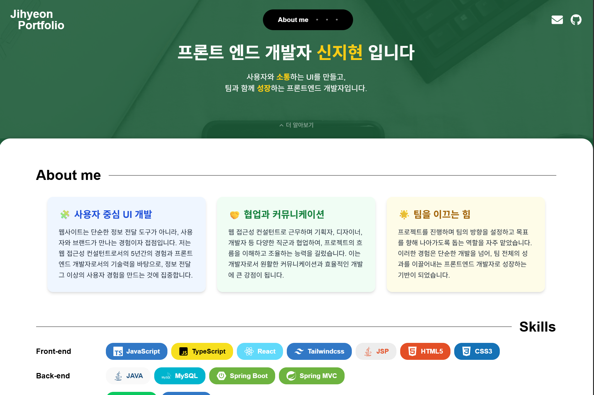

# 🌐 신지현 포트폴리오 웹사이트

프론트엔드 개발자 **신지현**의 포트폴리오 웹사이트입니다.  
직접 디자인하고 개발한 이 사이트는 **React**, **TypeScript** 기반으로 제작되었으며,  
개발 역량과 프로젝트 경험을 시각적으로 효과적으로 전달하기 위해 다양한 인터랙션과 모던 UI를 구현했습니다.

## 🙋‍♀️ About Me

프론트엔드 개발자로서 사용자 경험을 고려한 UI 설계와  
클린한 코드 구현에 가치를 두고 있습니다.  
**협업과 소통**, **문제 해결**을 핵심 역량으로 다양한 프로젝트에 기여하고 있습니다.

## 📫 Contact

- **Email**: jihyeons.dev@gmail.com
- **GitHub**: [github.com/Jihyeon818](https://github.com/Jihyeon818)  
<!-- - **Blog/Portfolio**: [포트폴리오 사이트](https://jihyeon818.github.io/jh_portfolio) -->
🔗 [포트폴리오 사이트 바로가기](https://jihyeon818.github.io/jh_portfolio)

## ✨ 주요 기능

- **심플한 인터랙티브 UI/UX**
- **반응형 웹 디자인** (모든 디바이스에 최적화)
- **기술 스택 배지 시각화**
- **프로젝트 상세 페이지 제공**
- **스크롤 기반 애니메이션 효과**
- **컴포넌트 기반 구조로 재사용성 향상**

## 🛠 기술 스택

| 구분         | 사용 기술                              |
|--------------|-----------------------------------------|
| **Frontend** | React, TypeScript, Vite, Tailwind CSS  |
| **상태 관리** | React Hook, Props                       |
| **아이콘**   | React Icons                             |
| **배포**     | GitHub Pages                            |
| **툴**       | VSCode, Git, Figma, Notion 등            |

## 💡 핵심 기능 설명

### [메인 페이지 구성]
- 소개(About), 기술 스택(Skills), 프로젝트(Projects), 경력(Career&Education)로 구성된 **단일 페이지 어플리케이션(SPA)**.
- 스크롤 및 메뉴 클릭 시 부드러운 이동 구현.

### [기술 스택 뱃지 시각화]
- `skillIcon.tsx`를 통해 기술 아이콘 및 이름, 색상 정보를 관리.
- `SkillIconCard` 컴포넌트로 재사용 가능한 기술 스택 뱃지 구현.

### [프로젝트 상세 정보 페이지]
- 각 프로젝트 클릭 시 상세 정보를 보여주는 **동적 라우팅 구조** 적용.
- 프로젝트 설명, 기술 스택, 기여도, 이미지 등 풍부한 정보 제공.

### [반응형 UI]
- Tailwind CSS를 활용하여 모바일부터 데스크탑까지 **다양한 해상도에서의 최적화** 제공.
- Grid, Flex 기반의 유동적 레이아웃 구성.

### [인터랙션 & 애니메이션]
- Hover, Scroll 등의 사용자 상호작용에 반응하는 **마이크로 인터랙션** 구현.
- Tailwind 기반 transition 효과 적용.

## 📌 향후 개선 사항

- 프로젝트 필터 기능 추가
- 다크 모드 기능

